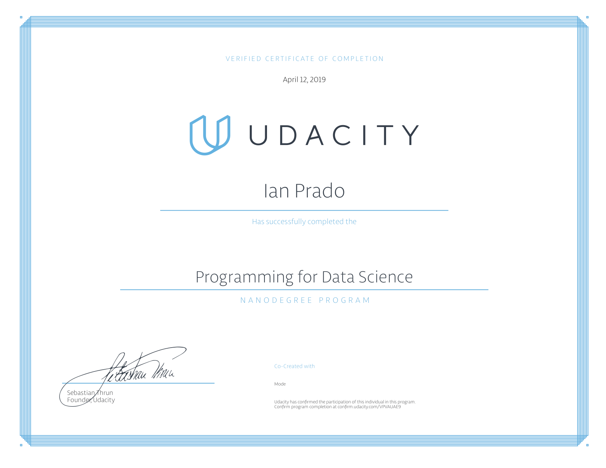

# Udacity-Nanodegrees
## Programming for Data Science with Python
:raised_hands::tada::grapes:
**What am I glad I learned?**
:raised_hands::tada::grapes:
1. git
   - I have been trying to use git for a while but I finally have working knowledge like
     - git's staging index
     - how to commit
     - remote repos
     - merge conflicts
     - etc
   - Mostly git porcelain and some git plumbing
2. python numpy and pandas
   - I have a background in math so the linear algebra wasn't that bad. I mainly had a hard time understanding how to use dataframes and its functions
3. sql
   - somethings I learned
     - joins
     - nested queries
     - window functions

